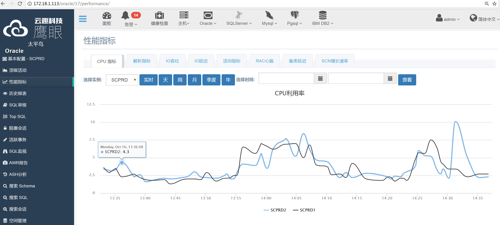

# 性能指标

 

功能包含：

1. 数据库性能指标（横坐标为时间，纵坐标为各种数据库指标），可以切换实例（如果有），选择时间纬度，选择时间区间，可以选择跟其他数据库的同一时间, 或者不同时间进行对比。

# 性能指标翻译

## db2:

ACTIVE_SORTS : 当前活跃的排序
TOTAL_SORTS : 平均每秒排序数
SORT_OVERFLOWS : 平均每秒排序溢出(排序数据量大, 内存放不下, 需要保存到磁盘上, 性能影响大)
APPLS_CUR_CONS : 当前连接数
APPLS_IN_DB2 : 当前活跃连接数
TOTAL_CONS : 平均每秒增加的连接数(每秒登录数)
NUM_ASSOC_AGENTS : 当前关联的子代理
COMMIT_SQL_STMTS : 平均每秒提交数
ROLLBACK_SQL_STMTS : 平均每秒回滚数
DYNAMIC_SQL_STMTS : 平均每秒动态SQL数
STATIC_SQL_STMTS : 平均每秒静态SQL数
FAILED_SQL_STMTS : 平均每秒失败SQL数(错误SQL)
SELECT_SQL_STMTS : 平均每秒查询数据数(SELECT)
UID_SQL_STMTS : 平均每秒增删改语句数(INSERT,UPDATE,DELETE)
DDL_SQL_STMTS : 平均每秒DDL数量
DIRECT_READS : 平均每秒直接路径读
DIRECT_WRITES : 平均每秒直接路径写
LOCKS_WAITING : 当前锁等待的代理数量
LOCKS_HELD : 当前被持有的锁数据量
LOCK_WAITS : 平均每秒等待锁的次数(所有连接)
LOG_READS : 平均每秒日志进程(logger进程)从磁盘读的日志页数
LOG_WRITES : 平均每秒日志进程(logger进程)从磁盘写的日志页数
POOL_DATA_L_READS : 平均每秒数据页逻辑读(从缓冲区获得)
POOL_TEMP_DATA_L_READS : 平均每秒临时表数据页逻辑读(从缓冲区获得)
POOL_INDEX_L_READS : 平均每秒索引数据页逻辑读(从缓冲区获得)
POOL_TEMP_INDEX_L_READS : 平均每秒临时表索引页逻辑读(从缓冲区获得)
POOL_XDA_L_READS : 平均每秒XML存储逻辑读(从缓冲区获得)
POOL_TEMP_XDA_L_READS : 平均每秒XML存储临时表逻辑读(从缓冲区获得)
POOL_DATA_P_READS : 平均每秒数据页物理读
POOL_TEMP_DATA_P_READS : 平均每秒临时数据页物理读
POOL_INDEX_P_READS : 平均每秒索引数据页物理读
POOL_TEMP_INDEX_P_READS : 平均每秒临时表索引数据页物理读
POOL_XDA_P_READS : 平均每秒索引数据页物理读
POOL_TEMP_XDA_P_READS : 平均每秒XML存储物理读
POOL_DATA_WRITES : 平均每秒数据页物理写
POOL_INDEX_WRITES : 平均每秒索引页物理写
POOL_XDA_WRITES : 平均每秒XML存储物理写
ROWS_DELETED : 平均每秒删除行数
ROWS_INSERTED : 平均每秒插入行数
ROWS_UPDATED : 平均每秒更新行数
ROWS_SELECTED : 平均每秒查询行数
ROWS_READ : 平均每秒读取行数